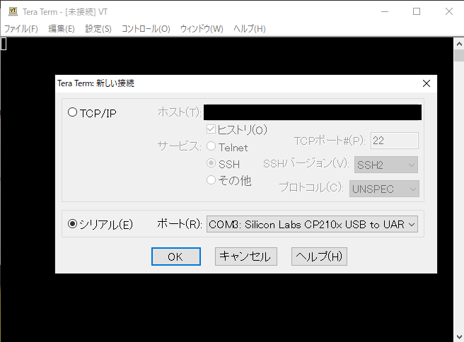

# IM920s_arduino サンプルスケッチ

Arduino UNO と IM920s でシリアル通信を行うサンプルスケッチ

## フォルダ内容

1. im920s_pairing 
   im920s のペアリング用プログラム、arduino uno に取り付けた IM920s にシリアルモニタから IM コマンドを打ち込み事が可能
1. im920s_ps3 
   コントローラ接続&受信側プログラム、キャラクタ入出力モード(文字列送信)でコントローラのデータを送信する。コントローラを接続しなければデータ送信がされないので注意
1. im920s_slave 
   受信側プログラム、キャラクタ入出力モード(文字列送信)でコントローラのデータを受信する。

## PlatformIO の導入、使い方

導入から使い方に関してはこの記事を参考して進めて欲しい 
[マイコン開発するなら PlatformIO がめちゃくちゃいいぞ #C++ - Qiita](https://qiita.com/JotaroS/items/1930f156aab953194c9a)

## ペアリング方法

### IM920s USB 変換アダプタと Tera Term を利用する方法

1. IM920s を USB 変換アダプタに取り付ける
1. USB 変換アダプタを PC に接続する。CP210x の表記が目印
    
1. **設定>シリアルポート**を選択し、スピードを**19200**に設定
    
1. **ENWR** という文字列をコピーし、**編集>貼り付け\<CR>** もしくは **Alt+R**でシリアルモニタに送信。**OK**という表示が出たら続ける
    
1. **STNN \[ノード番号]** を 4 と同じ手順で送信する。
   1. 親機に設定したい場合 **\[ノード番号]** は **0001**を指定。
   1. 子機は**0002** から **FFEF**まで指定可能。
   1. ノード番号は**STNN 1**のように指定できないので 0 埋めを行うこと
1. **STCH \[チャンネル番号]** を送信する。
   1. \[チャンネル番号]は**01** から **29**まで指定可能。
   1. チャンネル番号は通信先のデバイスと合わせる
   1. 今回のプログラムでは**16**を利用している
1. **RPRM**で設定内容を確認する。
   1. STCH が親機、子機共に一緒になっているか確認
   1. STNN は親機が**0001** 子機が**0002** から **FFEF**に設定されているか確認
      
1. **STGN**でペアリングする。 
   子機のシリアルモニタに **GRNOREGD** の表示が出て LED の点滅が止まったら、USB 端子を PC から外して再接続する。
    
1. 子機再接続後、親機から **TXDA \[任意の文字列]** でデータを送信する。
   子機のシリアルモニタにデータが送られたら成功
    

### Arduino IDE を利用する方法

1. Arduino IDE で**im920s_pairing/src** にある **im920s_pairing.ino**を開く
1. 子機と親機にプログラムを書き込む
1. Tera Term でのペアリングで記載されているコマンドをシリアルモニタに打ち込む
    

## 使い方

### Arduino IDE の場合

1. src フォルダの中にある.ino ファイルをクリックして Arduino IDE で開く。
1. 以降書き込み手順については割愛

### PlatformIO IDE の場合

1. vscode を開く
1. PlatformIO アイコンを選択し左メニューから**Pick a folder**をクリック
1. im920s_arduino 内の 3 つのフォルダから書き込みたいプログラムが入っているフォルダを選択する。
1. **Command+Shift+P**もしくは画面左下の矢印ボタンを押して書き込み
